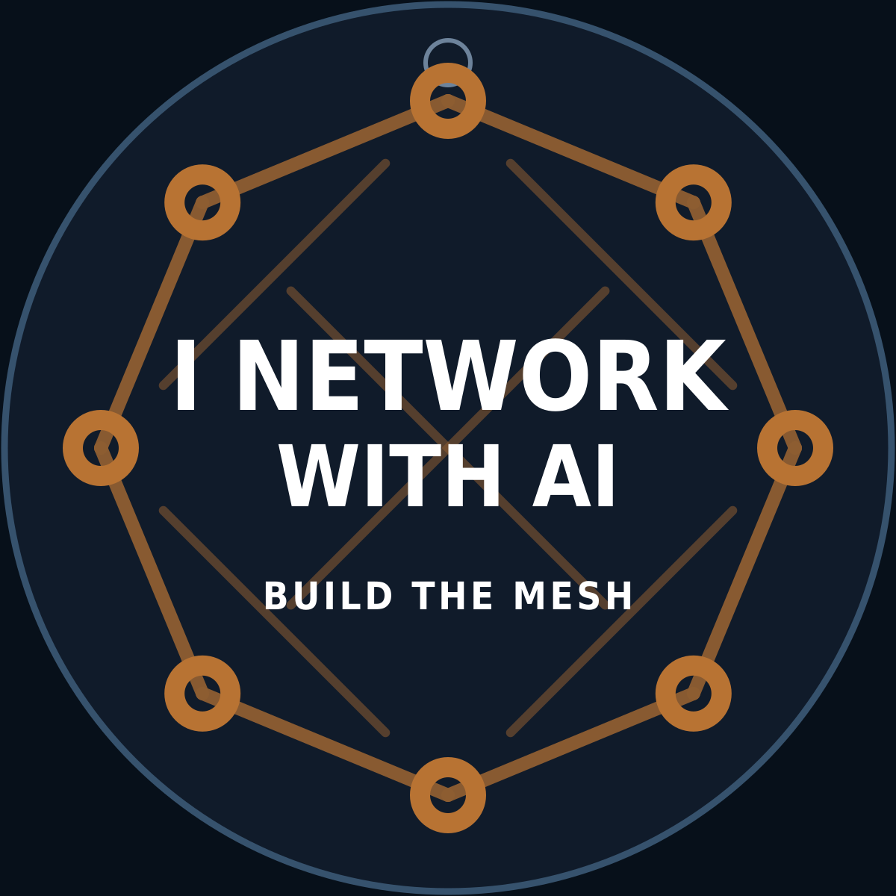

# AI Network Badge

<p align="center">
  
</p>

A self-contained ESP32-C3 conference badge. It hosts an open Wi-Fi captive portal so anyone who joins gets the badge web page automatically, drives an 8-pixel NeoPixel strip with four idle animations and seven scripted reaction effects, runs the "Build the Mesh" packet game with persistent score and level-ups, accepts contact card submissions through a web form and stores them in NVS, and quietly scans for nearby badges over BLE so two attendees with badges greet each other with a link-up animation.

## Features

- Open Wi-Fi SoftAP `AI-BADGE` with full captive portal (auto-launches the page on iOS, Android, and Windows).
- 8-pixel NeoPixel strip on GPIO 4 with four idle patterns: Packet Chase, AI Pulse, Network Sparkle, Rainbow Mesh.
- Seven reaction effects: PACKET, LINKUP, AI, STORM, GITHUB, LINKEDIN, CONTACT (4.5 s each).
- "Build the Mesh" game with levels Offline Node → Listening Node → Linked Node → Mesh Builder → AI Router → Supernode and a STORM celebration on every threshold cross.
- Contact card form (name / contact / note), input-sanitized and stored in NVS, capped at 25 entries, worth 3 packets per submission.
- BLE peer discovery: advertises as `AI-BADGE-MARSHALL`, scans every 20 s for 3 s, dedupes peers whose name starts with `AI-BADGE`, triggers LINKUP on a new peer.
- **Nearby Badges** section on the home page: each remembered peer shown with friendly RSSI label (Near / Far / Distant) plus raw dBm and first-seen relative time.
- **Recent Activity** feed on the home page: last 8 events (reactions, contacts, peer discoveries, level-ups) shown newest-first with relative timestamps. Volatile in RAM.
- **Per-badge admin key**: each badge boots with a unique 8-character hex key derived from its chip MAC. Optionally override it via NVS using the USB Serial console (`setkey=<value>` / `clearkey`). Reveal the active key from the web UI at `/admin/key` only while the BOOT button is physically held.
- BOOT button (GPIO 9) cycles idle patterns.
- Persistent settings (brightness, idle pattern, packet count, contact count, peer count) survive reboot via NVS namespace `badge`.
- Admin endpoints for listing, exporting (CSV), and clearing contacts, gated by the active per-badge admin key.

## Supported Boards

- Seeed XIAO ESP32-C3
- ESP32-C3 SuperMini

Both boards are pin-compatible for this firmware: GPIO 4 drives the LED data line and GPIO 9 is the onboard BOOT button.

## Prerequisites

- Arduino IDE 2.x, or Arduino CLI 1.x.
- ESP32 board package, installed via the Boards Manager URL:

  ```
  https://raw.githubusercontent.com/espressif/arduino-esp32/gh-pages/package_esp32_index.json
  ```

- Board selection per target:
  - Seeed XIAO ESP32-C3: `XIAO_ESP32C3` (or `ESP32C3 Dev Module` if Seeed variants aren't available in your installed core).
  - ESP32-C3 SuperMini: `ESP32C3 Dev Module`.
- Required libraries:
  - Adafruit NeoPixel — install via Library Manager.
  - ESP32 BLE — bundled with the `espressif/arduino-esp32` core, no separate install needed.

## Project Layout

```
firmware/
  firmware.ino   # the sketch
README.md
wiring.md
troubleshooting.md
```

## Configuration (Edit Before An Event)

Open `firmware/firmware.ino` and find the `CONFIG` block at the top of the file (between the `CONFIG — Edit values in this block to personalize the badge.` and `END CONFIG` banner comments). Update these six constants before handing the badge out:

- `BADGE_OWNER` — name shown on the badge web page.
- `BADGE_TITLE` — subtitle / role line under the owner name.
- `LINKEDIN_URL` — link for the "Connect on LinkedIn" button.
- `GITHUB_URL` — link for the "View GitHub" button.
- `BLE_BADGE_NAME` — local BLE advertising name; peers look for badges starting with the prefix below.
- `BLE_BADGE_PREFIX` — prefix used to detect peer badges during BLE scans.

Everything below the `END CONFIG` banner is implementation and shouldn't need editing.

### Admin Key (No Edit Needed)

There is intentionally no `ADMIN_KEY` constant in the CONFIG block. Each badge derives a unique key on first boot from its own chip MAC address (the last 4 bytes formatted as 8 lowercase hex characters), so two freshly flashed badges never share the same key. The active key is printed to the USB Serial console at boot.

To override it with a custom value, plug the badge into a serial terminal at 115200 baud and type:

```
setkey=your-custom-key
```

To revert to the MAC-derived default:

```
clearkey
```

The override is stored in NVS and survives reboots until you `clearkey` it. There is no web form for setting the key — over-the-air admin-key rotation is intentionally not supported.

## Build and Flash

### Arduino IDE 2.x

1. Open `firmware/firmware.ino`.
2. Tools → Board → select your target (`XIAO_ESP32C3` or `ESP32C3 Dev Module`).
3. Tools → Port → select the COM port the badge enumerated as.
4. Click Upload.

### Arduino CLI

```
arduino-cli core install esp32:esp32
arduino-cli lib install "Adafruit NeoPixel"
arduino-cli compile --fqbn esp32:esp32:esp32c3 firmware
arduino-cli upload --fqbn esp32:esp32:esp32c3 -p COM3 firmware
```

Replace `COM3` with the actual port on your system (e.g. `/dev/ttyUSB0` on Linux, `/dev/cu.usbmodem*` on macOS).

## First Boot Checklist

- Power the badge over USB.
- Open a serial terminal at 115200 baud and note the **active admin key** printed in the boot banner. It looks like `Admin contacts: http://192.168.4.1/contacts?key=ab12cd34`.
- Look for Wi-Fi network `AI-BADGE` (open, no password) on your phone or laptop.
- Joining should auto-launch the badge page; if not, open `http://192.168.4.1` in any browser.
- Confirm the new home-page sections render: **Nearby Badges** (empty until a second badge appears) and **Recent Activity** (should show the boot reaction shortly after).
- Try the LED reaction buttons (Send Packet, Establish Link, etc.) and watch the strip respond and the activity feed update.
- Submit a contact card and confirm it adds +3 packets to your count and shows up under Recent Activity.
- Admin URL: `http://192.168.4.1/contacts?key=<your-key>`. CSV export: `http://192.168.4.1/contacts.csv?key=<your-key>`.
- If you don't have the serial cable handy, hold the BOOT button on the badge and visit `http://192.168.4.1/admin/key` from your phone — it returns the active key in plain text only while the button is held.
- Press the BOOT button on the board to cycle idle patterns.

## Where Things Live

- Hardware diagrams, pin references, and power notes: `wiring.md`.
- Front vinyl, LED placement guide, and back label artwork for a 4-inch acrylic badge: `cricut/`.
- Common failure modes and recovery steps: `troubleshooting.md`.

## License / Credits

Personal project. Use at your own risk.
