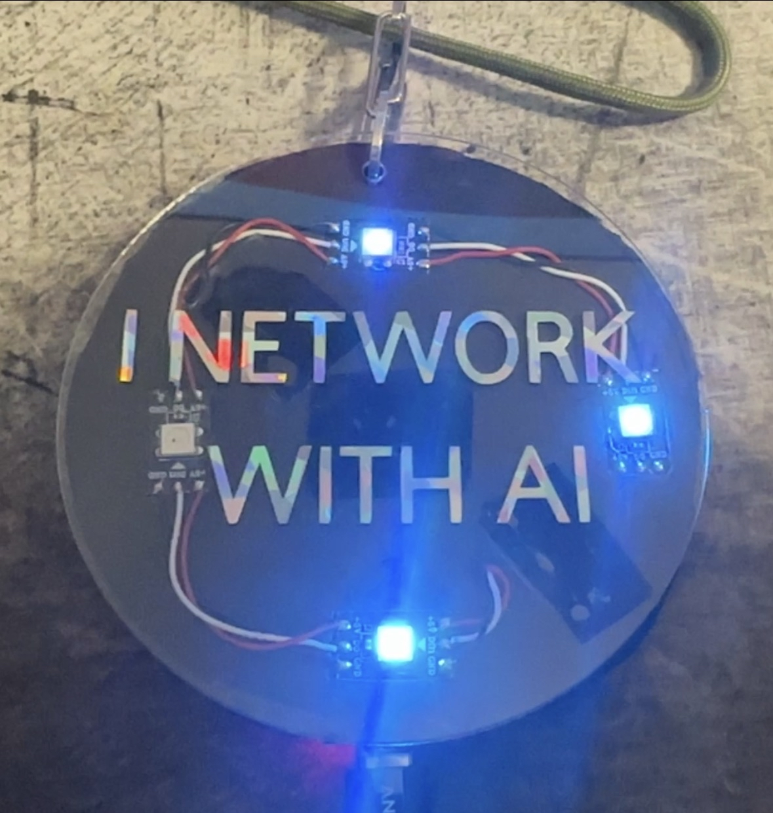

# AI Network Badge

<p align="center">
  
</p>

A self-contained ESP32-C3 conference badge. It hosts an open Wi-Fi captive portal so anyone who joins gets the badge web page automatically, drives a 4-pixel NeoPixel strip with four idle animations and seven scripted reaction effects, runs the "Build the Mesh" packet game with persistent score and level-ups, accepts contact card submissions through a web form and stores them in NVS, and quietly scans for nearby badges over BLE so two attendees with badges greet each other with a link-up animation.

## Features

- **Open Wi-Fi SoftAP** with a per-badge unique SSID (e.g. `AI-BADGE-A3F7`) derived from the chip MAC, with full captive portal (auto-launches the page on iOS, Android, and Windows).
- **4-pixel NeoPixel strip** on GPIO 4 with four idle patterns: Packet Chase, AI Pulse, Network Sparkle (default), Rainbow Mesh.
- **Seven reaction effects**: PACKET, LINKUP, AI, STORM, GITHUB, LINKEDIN, CONTACT (4.5 s each).
- **"Build the Mesh" game** with levels Offline Node → Listening Node → Linked Node → Mesh Builder → AI Router → Supernode and a STORM celebration on every threshold cross.
- **Contact card form** (name / contact / note), input-sanitized and stored in NVS, capped at 25 entries, worth 3 packets per submission.
- **BLE peer discovery**: advertises with a per-badge unique name (e.g. `AI-BADGE-A3F7`) derived from the chip MAC, scans every 20 s for 3 s, dedupes peers whose name starts with `AI-BADGE`, triggers LINKUP on a new peer.
- **Nearby Badges** section on the home page: shows active peers (seen in the last 60 s) with RSSI label and last-seen time. Stale peers are dimmed and grouped under "Previously seen."
- **Mesh Leaderboard** on the home page: ranks this badge and all nearby peers by packet count via BLE GATT score sync. Peers exchange scores automatically every 45 s.
- **Peer-aware idle mode**: when at least one BLE peer is nearby, LED 0 pulses a subtle green accent on top of the active idle pattern — a passive "you're not alone" indicator.
- **Recent Activity** feed on the home page: last 8 events (reactions, contacts, peer discoveries, level-ups) shown newest-first with relative timestamps. Volatile in RAM.
- **Per-badge unique identifiers**: the Wi-Fi SSID, BLE advertising name, and admin key are all derived from the chip's burned-in MAC address. Every badge is unique out of the box — no configuration needed. Override any of them in the CONFIG block (see code comments for details).
- **Web settings page** at `/settings`: change display name, title, LinkedIn URL, and GitHub URL from a browser — no reflashing needed. Settings are stored in NVS. Leave LinkedIn or GitHub blank to hide the button from the badge page. First visit forces an admin key change for security.
- **Leaderboard shows human names**: peers exchange display names via BLE GATT alongside scores. If a peer has set a custom name, it shows on the leaderboard instead of the raw BLE ID.
- **Owner login page** at `/admin`: friendly password prompt that sends the owner to the contacts admin page or the web console, depending on the `?next=` target. Wrong key bounces back with an inline error.
- **Web console** at `/console`: terminal-styled page for running USB-serial commands (`setkey=`, `clearkey`, `factoryreset`) over Wi-Fi. Gated by the active admin key.
- **OTA firmware update** at `/update`: upload a `.bin` file over Wi-Fi to flash new firmware without a USB cable. Gated by the active admin key.
- **Factory reset**: type `factoryreset` over USB serial, or hold the BOOT button while plugging in USB for 5 seconds, to wipe the entire NVS namespace `badge` and reboot.
- **Friendly hostname**: the badge advertises itself over mDNS as `badge.local` so visitors can type that instead of `192.168.4.1`. Works on macOS, iOS, and modern Android — falls back to the captive portal otherwise.
- **CPU die temperature** shown on the web page in °F and °C (internal sensor, not ambient — useful for diagnostics).
- **Underclocked to 80 MHz** to reduce power draw and die temperature. 80 MHz is the minimum for Wi-Fi; all badge functions remain unaffected.
- **Deep sleep**: long press BOOT (3 seconds) fades LEDs and enters deep sleep (~5 µA). Press RST to wake and reboot.
- **Persistent settings**: brightness, idle pattern, packet count, contact count, and peer count survive reboot via NVS namespace `badge`.
- **Admin endpoints** for listing, exporting (CSV), and clearing contacts, gated by the active per-badge admin key.

## Supported Boards

- Seeed XIAO ESP32-C3
- ESP32-C3 SuperMini

Both boards are pin-compatible for this firmware: GPIO 4 drives the LED data line and GPIO 9 is the onboard BOOT button.

## Prerequisites

- Arduino IDE 2.x, or Arduino CLI 1.x.
- ESP32 board package, installed via the Boards Manager URL:

  ```
  https://raw.githubusercontent.com/espressif/arduino-esp32/gh-pages/package_esp32_index.json
  ```

- Board selection per target:
  - Seeed XIAO ESP32-C3: `XIAO_ESP32C3` (or `ESP32C3 Dev Module` if Seeed variants aren't available in your installed core).
  - ESP32-C3 SuperMini: `ESP32C3 Dev Module`.
- Required libraries:
  - Adafruit NeoPixel — install via Library Manager.
  - NimBLE-Arduino — install via Library Manager. Search for "NimBLE-Arduino" by h2zero. Smaller and faster than the bundled BLEDevice library; the badge ships with NimBLE for binary-size headroom.
  - ESP32 mDNS — bundled with the `espressif/arduino-esp32` core, no separate install needed.

## Project Layout

```
firmware/firmware.ino    # the Arduino sketch
cricut/                  # 4-inch round badge artwork (vinyl + back label + QR)
README.md
wiring.md
troubleshooting.md
.kiro/                   # spec docs (requirements / design / tasks)
```

## Configuration

Open `firmware/firmware.ino` and find the `CONFIG` block at the top of the file (between the `CONFIG — Edit values in this block to personalize the badge.` and `END CONFIG` banner comments). Update these constants before handing the badge out:

| Constant | What it does |
| -------- | ------------ |
| `BADGE_OWNER` | Name shown on the badge web page |
| `BADGE_TITLE` | Subtitle / role line under the owner name |
| `LINKEDIN_URL` | Link for the "Connect on LinkedIn" button |
| `GITHUB_URL` | Link for the "View GitHub" button |
| `BLE_BADGE_NAME_OVERRIDE` | Custom BLE name. Leave `""` to auto-generate from MAC |
| `BLE_BADGE_PREFIX` | Prefix used to detect peer badges during BLE scans |
| `AP_SSID_OVERRIDE` | Custom Wi-Fi SSID. Leave `""` to auto-generate from MAC |
| `DEBUG_BLE_RSSI` | Set to `1` to print live BLE RSSI to serial (default `0`) |

Everything below the `END CONFIG` banner is implementation and shouldn't need editing.

### Per-Badge Unique Identifiers (No Edit Needed)

By default, the Wi-Fi SSID and BLE advertising name are automatically derived from the chip's burned-in MAC address — the last 2 bytes formatted as 4 uppercase hex characters, appended to `AI-BADGE-`. Every badge gets a unique network name out of the box.

To override either value with a custom string, set `AP_SSID_OVERRIDE` or `BLE_BADGE_NAME_OVERRIDE` in the CONFIG block.

### Admin Key (No Edit Needed)

Each badge derives its admin key from its own chip MAC address (the last 2 bytes as 4 lowercase hex characters). The active key is printed to the USB Serial console at boot.

To override with a custom value:

```
setkey=your-custom-key
```

To revert to the MAC-derived default:

```
clearkey
```

The override is stored in NVS and survives reboots.

## Build and Flash

### Arduino IDE 2.x

1. Open `firmware/firmware.ino`.
2. Tools → Board → select your target (`XIAO_ESP32C3` or `ESP32C3 Dev Module`).
3. Tools → Partition Scheme → **Minimal SPIFFS (1.9MB APP with OTA/128KB SPIFFS)**.
4. **ESP32C3 Dev Module only**: Tools → USB CDC On Boot → **Enabled**. (The XIAO board profile handles this automatically.)
5. Tools → Port → select the COM port.
6. Click Upload.

### Arduino CLI

```
arduino-cli core install esp32:esp32
arduino-cli lib install "Adafruit NeoPixel"
arduino-cli lib install "NimBLE-Arduino"
arduino-cli compile --fqbn esp32:esp32:esp32c3:PartitionScheme=min_spiffs,CDCOnBoot=cdc firmware
arduino-cli upload --fqbn esp32:esp32:esp32c3 -p COM3 firmware
```

Replace `COM3` with the actual port on your system.

## First Boot Checklist

1. Power the badge over USB.
2. Open a serial terminal at 115200 baud and note the admin key in the boot banner.
3. Look for the badge's Wi-Fi network (`AI-BADGE-XXXX`, open, no password).
4. Joining should auto-launch the badge page; if not, open `http://192.168.4.1` or `http://badge.local`.
5. Confirm **Nearby Badges** and **Recent Activity** sections render.
6. Try the LED reaction buttons and watch the strip respond.
7. Submit a contact card and confirm it adds +3 packets.
8. Press BOOT to cycle idle patterns.

## Resetting a Badge

| Level | Trigger | What it clears |
| ----- | ------- | -------------- |
| Mesh score | `http://192.168.4.1/resetcount` | Packets and peer count |
| Stored contacts | `http://192.168.4.1/clearcontacts?key=<your-key>` | All contact entries |
| Custom admin key | `clearkey` over USB serial | Key override (reverts to MAC default) |
| **Full factory reset** | `factoryreset` over USB serial, **or** hold BOOT 5 s while plugging in | Everything in the `badge` namespace |

**Factory reset without a serial cable:**

1. Unplug USB.
2. Press and hold BOOT.
3. Plug USB back in while still holding.
4. The LED strip pulses red and ramps up in brightness.
5. Keep holding for **5 seconds** — the badge wipes NVS and reboots.
6. Release before 5 seconds to abort.

## OTA Firmware Updates

The badge supports over-the-air firmware updates through its web interface.

### First-Time Setup (USB required once)

If your badge is using a different partition scheme, one USB flash is needed to switch to the OTA-capable layout:

1. Tools → Partition Scheme → **Minimal SPIFFS (1.9MB APP with OTA/128KB SPIFFS)**.
2. Upload via USB. This rewrites the partition table.
3. After this, all future updates can be done over Wi-Fi.

### Updating Over Wi-Fi

1. Download the `.bin` for your board from the [Releases page](https://github.com/slientnight/ai-network-badge/releases).
2. Connect to the badge Wi-Fi (`AI-BADGE-XXXX`).
3. Tap **Owner: Firmware Update** on the home page (or go to `http://192.168.4.1/update`).
4. Enter your admin key, upload the `.bin`, and the badge reboots with new firmware.

### Automated Builds

Every push to main is compiled by GitHub Actions for both supported boards. Tagged releases publish downloadable `.bin` files automatically.

## HTTP Endpoints

All routes served from `http://192.168.4.1/` while connected to the badge Wi-Fi.

| Method | Path | Auth | What it does |
| ------ | ---- | ---- | ------------ |
| GET | `/` | none | Badge home page |
| GET | `/trigger?fx=<name>` | none | Fires a reaction: `packet`, `linkup`, `ai`, `storm`, `github`, `linkedin` |
| POST | `/contact` | none | Submits a contact card (+3 packets) |
| GET | `/next` | none | Cycles idle pattern |
| GET | `/brightness?b=<n>` | none | Sets LED brightness (5–120) |
| GET | `/resetcount` | none | Resets mesh score and peer count |
| GET | `/admin` | none (login page) | Owner login form |
| GET | `/admin/key` | BOOT held | Returns admin key in plain text |
| GET | `/console` | admin key | Web serial console |
| GET | `/update` | admin key | OTA firmware upload page |
| GET | `/contacts?key=` | admin key | HTML list of stored contacts |
| GET | `/contacts.csv?key=` | admin key | CSV download of contacts |
| GET | `/clearcontacts?key=` | admin key | Wipes all stored contacts |
| GET | `/update` | admin key | OTA firmware update — upload a `.bin` to flash new firmware over Wi-Fi |
| GET/POST | `/settings` | admin key | Badge settings — edit display name, title, LinkedIn/GitHub URLs |

The badge also intercepts Apple, Android, and Windows captive-portal probe URLs.

## USB Serial Commands

Open a serial terminal at **115200 baud**.

| Command | What it does |
| ------- | ------------ |
| `setkey=<value>` | Sets a custom admin key |
| `clearkey` | Reverts to the MAC-derived admin key |
| `factoryreset` | Wipes NVS and reboots |

These commands also work from the **web console** at `/console`.

## Technical Notes

- **Partition scheme**: Minimal SPIFFS (1.9MB APP with OTA). The firmware is ~1.3 MB compiled.
- **CPU frequency**: 80 MHz (minimum for Wi-Fi). Change to 160 MHz in `setup()` if needed.
- **BLE GATT leaderboard**: Each badge exposes its packet count as a readable characteristic. Peers connect as GATT clients to read scores (one peer every ~10 s).
- **Peer timeout**: 60 seconds (roughly 3 BLE scan cycles). After that, peers fade from the leaderboard and active list.
- **Die temperature**: Internal chip sensor, not ambient. Typical 30–50°C.
- **Deep sleep**: ~5 µA draw. Wake via RST button.

## Where Things Live

- Hardware diagrams, pin references, and power notes: `wiring.md`
- Badge artwork (vinyl + back label + QR): `cricut/`
- Common failure modes and recovery: `troubleshooting.md`

## License / Credits

Personal project. Use at your own risk.
